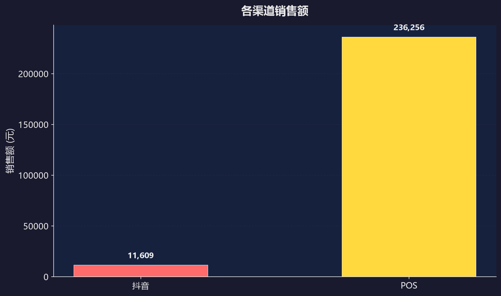
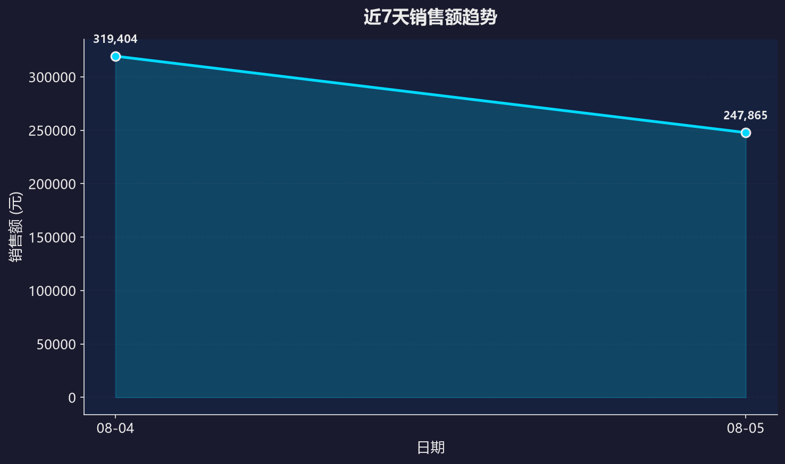

# 销售日报 2026-08-05

## 📊 今日概览

- **全渠道销售额：** 247,865 元（环比 -22.4%）
- **总销量：** 19 件
- **整体毛利率：** 99.6%

## 🏪 渠道拆分

| 渠道 | 销售额 | 占比 | 环比 |
|------|--------|------|------|
| 天猫 | 0 元 | 0.0% | 0.00% |
| 抖音 | 11,609 元 | 4.68% | -72.38% |
| POS | 236,256 元 | 95.32% | -14.83% |

## 📦 品类 TOP3

| 排名 | 品类代码 | 销售额 |
|------|----------|--------|
| 1 | KY | 156,816 元 |
| 2 | KV | 50,868 元 |
| 3 | KW | 17,424 元 |

## 🏆 畅销 TOP3 / 滞销 TOP3

### 畅销 TOP3

| 排名 | 商品编码 | 销量 |
|------|----------|------|
| 1 | KD04862C140 | 2 |
| 2 | KA01915W042 | 1 |
| 3 | KF12506W040 | 1 |

### 滞销 TOP3

| 排名 | 商品编码 | 销量 |
|------|----------|------|
| 1 | KY00561P440 | 1 |
| 2 | KY00591X538 | 1 |
| 3 | LA01816W038 | 1 |

## 📈 数据图表

### 渠道销售额

### 近7天趋势

## ⚠️ 异常预警

| 类型 | 对象 | 详情 | 阈值 |
|------|------|------|------|
| 渠道销售额异常 | 抖音 | 环比下降 72.38% | 下降超过20% |

---
*报告生成时间: 2026-08-10 11:17:07*