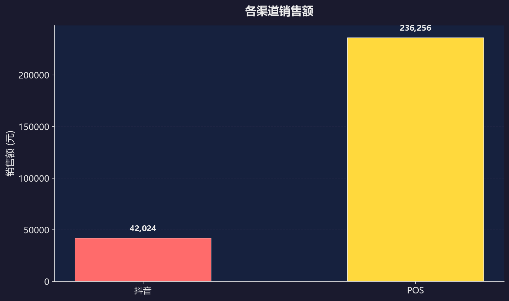
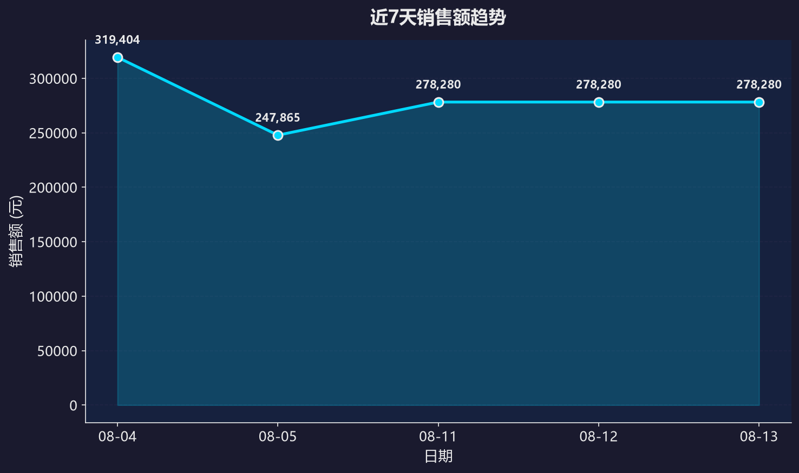

# 销售日报 2026-08-13

## 📊 今日概览

- **全渠道销售额：** 278,280.50 元（环比 0.0%）
- **总销量：** 24 件
- **整体毛利率：** 98.57%

## 🏪 渠道拆分

| 渠道 | 销售额 | 占比 | 环比 |
|------|--------|------|------|
| 天猫 | 0 元 | 0.0% | 0.00% |
| 抖音 | 42,024.50 元 | 15.1% | 0.0% |
| POS | 236,256.00 元 | 84.9% | 0.0% |

## 📦 品类 TOP3

| 排名 | 品类代码 | 销售额 |
|------|----------|--------|
| 1 | KY | 174,240.00 元 |
| 2 | KV | 62,016.00 元 |
| 3 | KW | 17,424.00 元 |

## 🏆 畅销 TOP3 / 滞销 TOP3

### 畅销 TOP3

| 排名 | 商品编码 | 销量 |
|------|----------|------|
| 1 | KY00542P544 | 3 |
| 2 | KD04862C140 | 2 |
| 3 | KA01990W036 | 2 |

### 滞销 TOP3

| 排名 | 商品编码 | 销量 |
|------|----------|------|
| 1 | KY00561P440 | 1 |
| 2 | KY00591X538 | 1 |
| 3 | LA01816W038 | 1 |

## 📈 数据图表

### 渠道销售额

### 近7天趋势

## ⚠️ 异常预警

✅ 今日无异常

---
*报告生成时间: 2026-08-13 08:30:05*